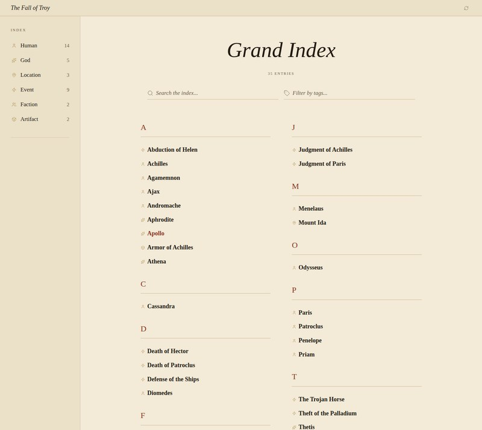
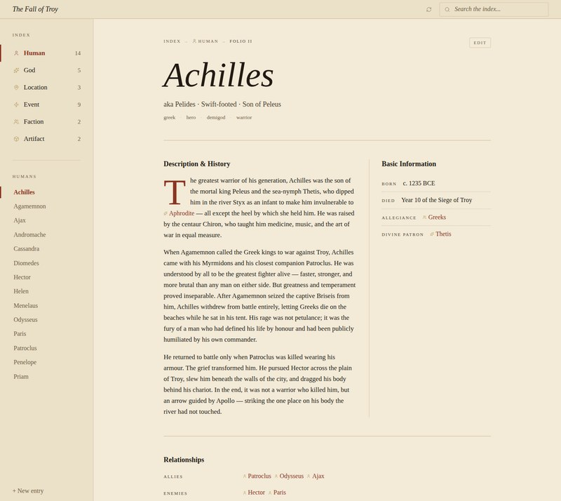

# Axiom Forge

[](https://github.com/dyvoid/axiom-forge/actions/workflows/ci.yml)
[](LICENSE)
[](https://www.typescriptlang.org/)
[](https://nodejs.org/)

A schema-driven, local-first encyclopedia and worldbuilding tool. Your world lives as a folder of plain Markdown files on disk; Axiom Forge reads them, parses structured fields out of standard Markdown headings and lists, and gives you a fast, beautiful, navigable web UI for reading, linking, and editing.

No database. No cloud. No lock-in. The Markdown files *are* the source of truth — open them in any editor, commit them to Git, sync them however you like.

| Landing | Grand Index | Folio |
|---|---|---|
|  |  |  |

## Why

Most worldbuilding tools either (a) lock your content inside a proprietary database, or (b) leave you alone with a folder of free-form notes that drift out of structure as the world grows. Axiom Forge sits in between: you describe the *shape* of your world once in a `schema.json`, and every Markdown file is parsed and validated against it. Wikilinks between entries are first-class. The web app renders structured views; the underlying files stay portable.

## Features

- **Plain Markdown on disk** — every entry is a `.md` file you can read, edit, version, and share without the app.
- **Schema-driven** — define your world's types (Characters, Locations, Events, …) and fields once. The UI adapts.
- **Field types** — text, date, select, multiselect, text-list, wikilink, wikilink-list, textarea (prose).
- **Wikilinks** — `[[Folder/EntryName]]` syntax, rendered as clickable chips that resolve to live entries.
- **Sidebar navigation** — types and entries are indexed automatically as files are added.
- **Read & edit views** — click Edit on any entry to modify fields and prose; saves write back to disk.
- **Schema warnings** — invalid sections, broken wikilinks, or unknown fields surface as warnings on load.

## Quick start

### Requirements

- Node.js ≥ 18.17
- npm ≥ 9

### Install

```bash
git clone https://github.com/dyvoid/axiom-forge.git
cd axiom-forge
npm install
```

### Run

The repo ships with a sample project — `fall-of-troy` — so you can try it immediately:

```bash
npm run dev
```

Then open <http://localhost:5173>.

There are also launchers at the repo root that install dependencies on first run and start
both servers, so a fresh clone needs one step instead of two — `start.bat` on Windows,
`./start.sh` on Linux and macOS. Extra arguments are forwarded to the server, and `--project`
wants an absolute path:

```bash
./start.sh --project /home/you/worlds/my-project
```

```bat
start.bat --project "C:\Users\you\worlds\my-project"
```

Two wikilinks in the sample point at entries that do not exist — `Humans/Aeneas` and
`Humans/Astyanax`. These are **left broken on purpose**, so the broken-link detection has something
to find on a fresh clone. Both are figures whose stories run past the fall of the city, so they read
naturally as entries nobody has written yet. Please don't "fix" them.

To run against your own project folder:

```bash
npm run dev -- --project ./path/to/your/project
```

## Project structure

A project folder contains:

```
my-world/
├── config.json         # name, description, version, theme
├── schema.json         # type definitions
├── Characters/
│   ├── Alice.md
│   └── Bob.md
├── Locations/
│   └── Crete.md
└── Events/
    └── Battle_of_Kea.md
```

### `config.json`

```json
{
  "name": "My World",
  "description": "A short tagline",
  "version": "1.0.0",
  "theme": { "accent": "#9a7a2c" }
}
```

### `schema.json`

Defines the types your world supports and the sections and fields each type has. Example fragment:

```json
{
  "version": "1.0.0",
  "types": {
    "Character": {
      "icon": "person",
      "folder": "Characters",
      "sections": {
        "Basic Information": {
          "role": "meta",
          "fields": {
            "Age": { "type": "text" },
            "Place of Origin": { "type": "wikilink", "target": "Locations" }
          }
        },
        "Description & History": { "role": "prose", "type": "textarea" }
      }
    }
  }
}
```

See `fall-of-troy/schema.json` for a full working example with all field types in use.

### Markdown files

Each entry's filename (without `.md`) is its stable ID. The YAML frontmatter is Obsidian-compatible and declares the type, tags, and optional aliases; sections and fields below match the schema:

```markdown
---
type: Human
tags:
  - greek
  - hero
  - demigod
aliases:
  - Pelides
  - Swift-footed
---

# Achilles

## Basic Information
- **Epithets:** Swift-footed, Lion-hearted, Son of Peleus
- **Sex:** Male
- **Born:** c. 1235 BCE
- **Allegiance:** [[Factions/Greeks]]
- **Divine Patron:** [[Gods/Thetis]]

## Description & History
The greatest warrior of his generation…

## Relationships
- **Allies:** [[Humans/Patroclus]], [[Humans/Odysseus]]
- **Enemies:** [[Humans/Hector]]

## Connected Events
- [[Events/Death_of_Hector]]
- [[Events/Fall_of_Troy]]
```

## Architecture

This is an npm-workspaces monorepo with three packages:

| Package | Role |
|---|---|
| `@axiom-forge/shared` | Markdown parser, schema types, wikilink helpers — used by both server and client |
| `@axiom-forge/server` | Express server: scans the project folder, indexes folios, serves the API |
| `@axiom-forge/client` | React + Vite UI |

The server reads the project folder once on startup, parses every Markdown file into structured data, and serves it via JSON. The client is a SPA that calls the API and renders read/edit views. Saves go back to disk via the server.

## Scripts

| Script | What it does |
|---|---|
| `npm run dev` | Starts server (`:3000`) and client (`:5173`) concurrently with hot reload |
| `npm run build` | Compiles all three packages |
| `npm start` | Runs the compiled server (after `build`) |
| `npm test` | Runs the Vitest suite |
| `npm run lint` | Runs ESLint and markdownlint |

## Documentation

For full architectural details, data models, and design systems, see the [`docs/`](docs/) directory. For upcoming features and architecture decisions, see the [`docs/adr/`](docs/adr/) directory.

## Status

The core feature set is complete and ready for daily use: read/edit views, live search and tag filtering, backlinks, broken-link detection, and project-wide link rewriting on rename. New features are tracked in [`docs/ROADMAP.md`](docs/ROADMAP.md).

## License

MIT — see [LICENSE](LICENSE).
